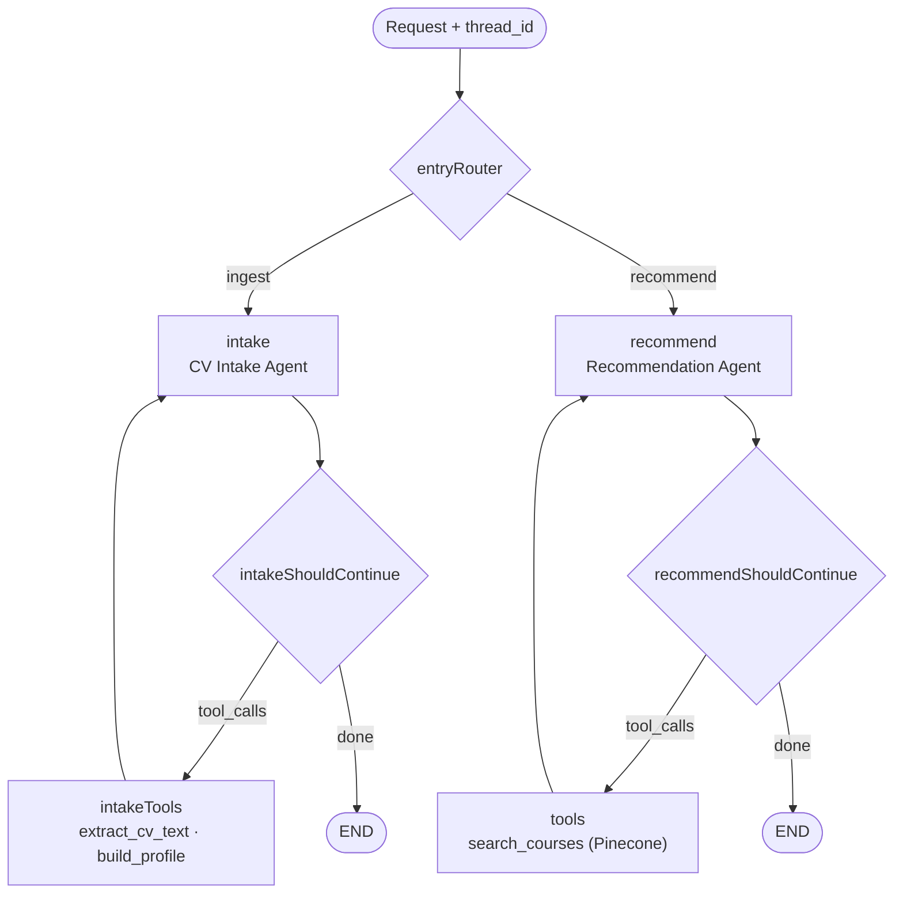

# Udemy Course Recommender (LangGraph · CV → Courses · Pinecone)

[](LICENSE)
[](https://nextjs.org/)
[](https://langchain-ai.github.io/langgraphjs/)
[](https://www.pinecone.io/)
[](https://udemy-course-recommender-osmin.vercel.app)

**Live demo:** https://udemy-course-recommender-osmin.vercel.app

Upload a CV/Resume (**PDF, DOCX or PNG/JPG**) and the app summarizes your developer profile
(**Level · Role · Skillset**), then recommends the **TOP 3 Udemy courses** to level up in your current
role — or to **pivot** into a new one at your current level. It is built as an **agentic LangGraph**
workflow over a **Pinecone** vector store seeded from the Kaggle Udemy course catalog.

> Example: a PNG resume for a "Junior Frontend Developer (HTML, CSS, JavaScript, React.js, Next.js, Vercel)"
> is OCR'd, summarized to `Junior Level, Frontend developer, skillset: HTML, CSS, ...`, and a request to
> "pivot into mobile development at my current level" returns React Native / Kotlin / Swift courses.

---

## 🌟 Key Features

- **Two tool-calling agents in one LangGraph** — a single compiled `StateGraph` with two entry modes
  (`ingest`, `recommend`) chosen by a conditional edge at `START`, backed by a persistent Postgres checkpointer.
  1. **CV Intake Agent** — a tool-calling agent that calls `extract_cv_text` (reads the file) then
     `build_profile` (classifies it into a structured `{ level, role, skills }` profile).
  2. **Course Recommendation Agent** — a tool-calling agent that queries the Udemy catalog through the
     **`search_courses`** vector tool and returns the TOP 3 matches.
- **Multi-format CV parsing** — the `extract_cv_text` tool handles PNG/JPG via a **Gemini vision model
  (OCR)**, PDF via `pdf-parse`, and DOCX via `mammoth`.
- **Metadata filtering in the vector DB** — `search_courses` passes `level`/`subject` as a Pinecone
  metadata `filter`, so narrowing happens in the index, not in a prompt.
- **File bytes never touch the checkpoint** — the uploaded file is passed through the run config, not graph
  state, so its base64 is never serialized into the persisted checkpoint. Uploads are capped at 5 MB.
- **Real Vector DB (Pinecone, 3072 dims)** — the Udemy catalog (Kaggle dataset, parsed with LangChain's
  **`CSVLoader`**) is embedded with `gemini-embedding-001` and stored in a shared `courses` namespace,
  populated by `npm run ingest`. Vectors live in Pinecone, **not** in graph state.
- **Token Streaming** — recommendations stream token-by-token via `stream()` with `streamMode: "messages"`.
- **Node-Level Retry** — every node has an exponential-backoff `retryPolicy` (the LLM/OCR calls are the failure-prone parts).
- **Per-User Persistence & Idempotent Re-upload** — `thread_id` is `${sessionId}_${cvId}` (`sessionId` is a
  per-browser UUID, `cvId` a content hash of the CV). State is checkpointed to Postgres, so each user gets an
  isolated, server-side history via `graph.getState()`; re-uploading the same CV resumes that conversation
  instead of reprocessing it. API routes require the caller's `sessionId` and reject threads it doesn't own.

---

## 📊 LangGraph Architecture



**Agent 1 (CV Intake)** = `intake` ⇄ `intakeTools`. **Agent 2 (Recommendation)** = `recommend` ⇄ `tools`.
The uploaded file rides in the run config (not state); `extract_cv_text` reads it there, so the raw
bytes never enter the checkpoint.

---

## 🛠️ Tech Stack

| Concern | Choice |
| --- | --- |
| Framework | Next.js 16 (App Router, JS/JSX) |
| Orchestration | LangGraph JS (`@langchain/langgraph`) |
| LLM / Vision | Google Gemini `gemini-3.5-flash-lite` (chat + OCR) |
| Embeddings | Google Gemini `gemini-embedding-001` (3072 dims) |
| Vector DB | Pinecone (`@pinecone-database/pinecone`) |
| CV parsing | `pdf-parse` (PDF), `mammoth` (DOCX), Gemini vision (image OCR) |
| Persistence | Postgres checkpointer (`@langchain/langgraph-checkpoint-postgres`) |
| UI | Ant Design 6 |

---

## ⚙️ Setup

1. **Install dependencies**

   ```bash
   npm install
   ```

2. **Create a Pinecone index**
   - Log in at [pinecone.io](https://www.pinecone.io/)
   - Create index `udemy-courses` · metric `cosine` · dimensions `3072`

3. **Configure `.env.local`** (copy from `.env.example`)

   ```env
   GOOGLE_API_KEY=your_google_gemini_api_key
   PINECONE_API_KEY=your_pinecone_api_key
   PINECONE_INDEX_NAME=udemy-courses
   DATABASE_URL=your_postgres_connection_string
   ```

   `DATABASE_URL` is a Postgres connection string for the LangGraph checkpointer.

4. **Seed the course catalog** — download the Kaggle dataset
   ([yusufdelikkaya/udemy-online-education-courses](https://www.kaggle.com/datasets/yusufdelikkaya/udemy-online-education-courses))
   to `./data/udemy_courses.csv`, then run the one-time ingest. It parses the CSV with LangChain's
   `CSVLoader`, embeds each course with `gemini-embedding-001`, and upserts them into the `courses` namespace:

   ```bash
   npm run ingest ./data/udemy_courses.csv
   ```

5. **Run**

   ```bash
   npm run dev
   ```

   Open [http://localhost:5002](http://localhost:5002).

---

## 🧪 Test CVs

| Format | Source |
| --- | --- |
| PDF | https://d25zcttzf44i59.cloudfront.net/web-developer-resume-example.pdf |
| DOCX | [Google Docs resume](https://docs.google.com/document/d/1-dozESPE5ND2w6BTxHhuQb2s4DAdwAV6yI7v7V0mSsk/edit) → File ▸ Download ▸ .docx |
| PNG/JPG | Any resume screenshot (parsed via vision OCR) |

Then ask, e.g. _"level up my full-stack skills"_ or _"help me pivot into mobile development at my current level"_.

---

## 🚀 Deployment

Both stores are managed services, so there's no local disk to manage:

**Demo:**:

https://github.com/user-attachments/assets/93faafd4-ad63-4c3e-b3cc-94ab464250fa

- **Vectors** live in Pinecone (a cloud API).
- **Conversation state** lives in Postgres via the LangGraph checkpointer.

On **Vercel**, set `GOOGLE_API_KEY`, `PINECONE_API_KEY`, `PINECONE_INDEX_NAME`, and `DATABASE_URL` in the
project's environment variables and deploy. The API routes run on the Node.js runtime — no local filesystem
is used (which is why the SQLite checkpointer was replaced by Postgres).

> **Auth note:** there is no user login. A thread is keyed by a per-browser `sessionId` (a random UUID), and
> the API rejects any request whose `threadId` doesn't belong to the caller's `sessionId`. This stops a
> browser from reading another's thread by guessing ids, but it is **not** real authentication — anyone
> holding a `sessionId` can reach its threads. Add real auth before using this with sensitive data.

**Live demo:** https://udemy-course-recommender-osmin.vercel.app

---

## 📄 License

Copyright 2026 Extrawest

Licensed under the Apache License, Version 2.0 (the "License");
you may not use this file except in compliance with the License.
You may obtain a copy of the License at

    http://www.apache.org/licenses/LICENSE-2.0

Unless required by applicable law or agreed to in writing, software
distributed under the License is distributed on an "AS IS" BASIS,
WITHOUT WARRANTIES OR CONDITIONS OF ANY KIND, either express or implied.
See the License for the specific language governing permissions and
limitations under the License.
