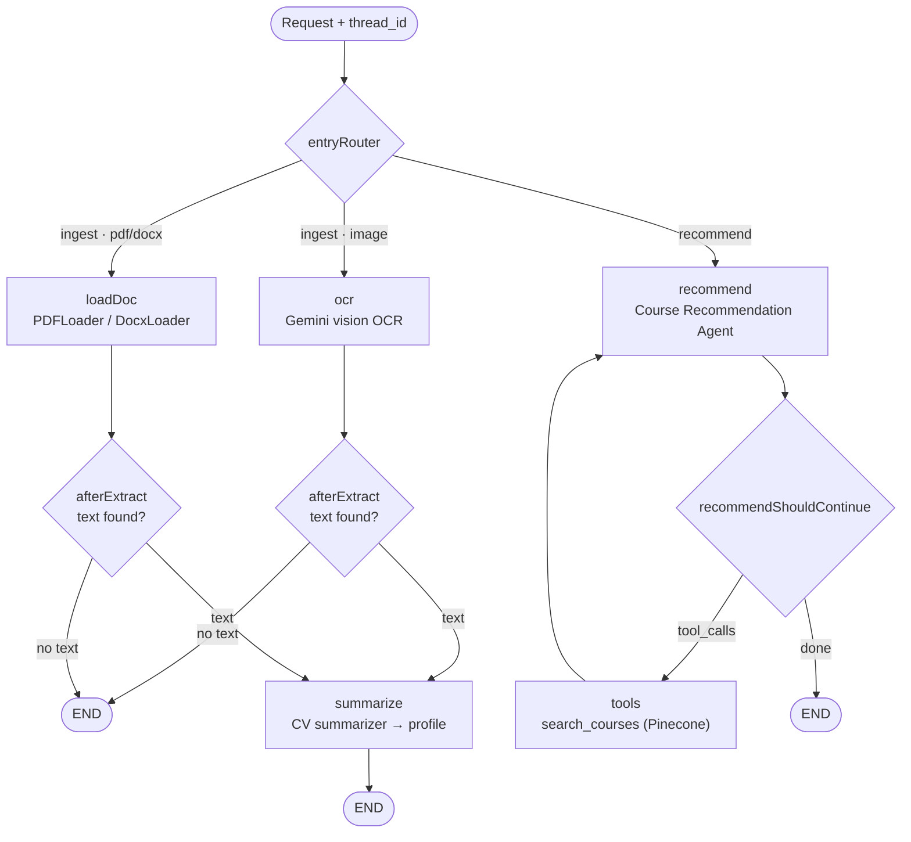

# Udemy Course Recommender (LangGraph · CV → Courses · Pinecone)

[](LICENSE)
[](https://nextjs.org/)
[](https://langchain-ai.github.io/langgraphjs/)
[](https://www.pinecone.io/)

Upload a CV/Resume (**PDF, DOCX or PNG/JPG**) and the app summarizes your developer profile
(**Level · Role · Skillset**), then recommends the **TOP 3 Udemy courses** to level up in your current
role — or to **pivot** into a new one at your current level. It is built as an **agentic LangGraph**
workflow over a **Pinecone** vector store seeded from the Kaggle Udemy course catalog.

> Example: a PNG resume for a "Junior Frontend Developer (HTML, CSS, JavaScript, React.js, Next.js, Vercel)"
> is OCR'd, summarized to `Junior Level, Frontend developer, skillset: HTML, CSS, ...`, and a request to
> "pivot into mobile development at my current level" returns React Native / Kotlin / Swift courses.

---

## 🌟 Key Features

- **Two Agents in One LangGraph** — a single compiled `StateGraph` with two entry modes (`ingest`, `recommend`)
  routed by a conditional edge at `START`, backed by a persistent SQLite checkpointer.
  1. **CV Intake Agent** — extracts CV text (by file type) and runs the **CV summarizer** tool to produce a
     structured `{ level, role, skills }` profile.
  2. **Course Recommendation Agent** — a tool-calling agent that queries the Udemy catalog through the
     **`search_courses`** vector tool and returns the TOP 3 matches.
- **Multi-format CV parsing** — PNG/JPG via a **Gemini vision model (OCR)**, PDF via LangChain's `PDFLoader`
  (pdf-parse), DOCX via `DocxLoader` (mammoth). The file type is a **conditional edge**, not an `if` in a route.
- **Real Vector DB (Pinecone, 3072 dims)** — the Udemy catalog (Kaggle dataset, parsed offline with LangChain's
  **`CSVLoader`**) is embedded with `gemini-embedding-001` and stored in a shared `courses` namespace; the app
  reads it via similarity search. Vectors live in Pinecone, **not** in graph state.
- **Conditional "skip" edge** — if extraction yields no text (unreadable file), the graph skips summarization
  and ends gracefully instead of calling the LLM on empty input.
- **Token Streaming** — recommendations stream token-by-token via `stream()` with `streamMode: "messages"`.
- **Node-Level Retry** — every node has an exponential-backoff `retryPolicy` (the LLM/OCR calls are the failure-prone parts).
- **Per-User Persistence & Idempotent Re-upload** — `thread_id` is `${sessionId}_${cvId}` (`sessionId` is a
  per-browser UUID, `cvId` a content hash of the CV). State is checkpointed to on-disk SQLite, so each user gets
  an isolated, server-side history via `graph.getState()`; re-uploading the same CV resumes that conversation
  instead of reprocessing it.

---

## 📊 LangGraph Architecture



**Agent 1 (CV Intake)** = `ocr` / `loadDoc` → `summarize`. **Agent 2 (Recommendation)** = `recommend` ⇄ `tools`.

---

## 🛠️ Tech Stack

| Concern | Choice |
| --- | --- |
| Framework | Next.js 16 (App Router, JS/JSX) |
| Orchestration | LangGraph JS (`@langchain/langgraph`) |
| LLM / Vision | Google Gemini `gemini-3.5-flash-lite` (chat + OCR) |
| Embeddings | Google Gemini `gemini-embedding-001` (3072 dims) |
| Vector DB | Pinecone (`@pinecone-database/pinecone`) |
| CV loaders | `PDFLoader` (pdf-parse), `DocxLoader` (mammoth), vision OCR |
| Persistence | SQLite checkpointer (`@langchain/langgraph-checkpoint-sqlite`) |
| UI | Ant Design 6 |

---

## ⚙️ Setup

1. **Install dependencies**

   ```bash
   npm install
   ```

2. **Create a Pinecone index**
   - Log in at [pinecone.io](https://www.pinecone.io/)
   - Create index `udemy-courses` · metric `cosine` · dimensions `3072`

3. **Configure `.env.local`** (copy from `.env.example`)

   ```env
   GOOGLE_API_KEY=your_google_gemini_api_key
   PINECONE_API_KEY=your_pinecone_api_key
   PINECONE_INDEX_NAME=udemy-courses
   ```

4. **Course catalog** — the app reads a pre-loaded Udemy catalog from Pinecone (namespace `courses`). It was
   built once, offline, from the Kaggle dataset
   ([yusufdelikkaya/udemy-online-education-courses](https://www.kaggle.com/datasets/yusufdelikkaya/udemy-online-education-courses)):
   the CSV was parsed with LangChain's `CSVLoader`, each course embedded with `gemini-embedding-001`, and
   upserted into the index. Nothing to run here — populate the index once against your own Pinecone project.

5. **Run**

   ```bash
   npm run dev
   ```

   Open [http://localhost:5002](http://localhost:5002).

---

## 🧪 Test CVs

| Format | Source |
| --- | --- |
| PDF | https://d25zcttzf44i59.cloudfront.net/web-developer-resume-example.pdf |
| DOCX | [Google Docs resume](https://docs.google.com/document/d/1-dozESPE5ND2w6BTxHhuQb2s4DAdwAV6yI7v7V0mSsk/edit) → File ▸ Download ▸ .docx |
| PNG/JPG | Any resume screenshot (parsed via vision OCR) |

Then ask, e.g. _"level up my full-stack skills"_ or _"help me pivot into mobile development at my current level"_.

---

## 🚀 Deployment

Pinecone is a cloud API, so no persistent disk is needed for vectors. The only local artifact is the SQLite
checkpoint file (`./data/checkpoints.sqlite`). For Vercel, swap `SqliteSaver` for a Postgres-backed
checkpointer (`@langchain/langgraph-checkpoint-postgres`) and add a `POSTGRES_URL` env var.

**Demo:** _add your deployed URL here and in the repository About section._

---

## 📄 License

Copyright 2026 Extrawest

Licensed under the Apache License, Version 2.0 (the "License");
you may not use this file except in compliance with the License.
You may obtain a copy of the License at

    http://www.apache.org/licenses/LICENSE-2.0

Unless required by applicable law or agreed to in writing, software
distributed under the License is distributed on an "AS IS" BASIS,
WITHOUT WARRANTIES OR CONDITIONS OF ANY KIND, either express or implied.
See the License for the specific language governing permissions and
limitations under the License.
